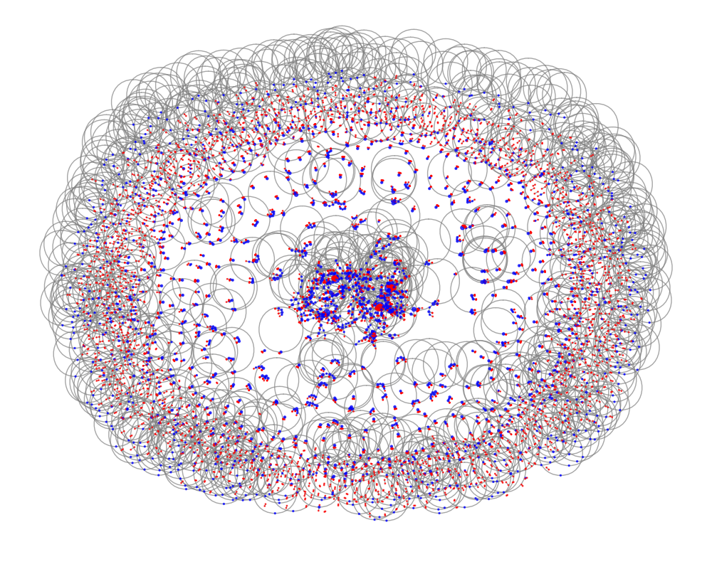

# Informe sobre YouTube
## Autores: 
- Mario Gallego Hernández.
- Mario Carrilero Sánchez.
- Diego Linares Espildora.
- Álvaro Llera Calderón.

Este informe presenta un estudio sobre la plataforma **YouTube**, en el que se incluyen el análisis de los comentarios de los usuarios mediante la construcción de grafos y cómo extraer datos de esta red social utilizando la **API de Google**. 

A lo largo de este documento se justifica el uso de nodos y aristas como modo de representación de los comentarios y sus respuestas, además de un análisis sobre la estructura del código utilizado en el proyecto junto con los resultados obtenidos analizados. 

---

# Índice

1. [Introducción a YouTube](#1-introducción-a-youtube)
2. [Justificación de la representación con nodos y aristas](#2-justificación-de-la-representación-con-nodos-y-aristas)
3. [Extracción de datos con la API de YouTube](#3-extracción-de-datos-con-la-api-de-youtube)
4. [Explicación de la estructura del código](#4-explicación-de-la-estructura-del-código)
5. [Flujo de ejecución y Análisis de resultados](#5-flujo-de-ejecución-y-análisis-de-resultados)

---

# 1. Introducción a YouTube

**YouTube** es una de las plataformas más populares a nivel mundial para la visualización y compartición de vídeos. Fundada en 2005 y adquirida por Google en 2006, YouTube ha crecido exponencialmente y actualmente alberga una gran cantidad de contenido generado por usuarios, que comprende desde entretenimiento hasta educación. Los usuarios pueden interactuar con los vídeos mediante comentarios, "me gusta", "no me gusta", y suscripciones a canales.

La interacción de los usuarios, especialmente a través de los comentarios, crea una red de conversaciones que puede ser analizada para obtener valiosa información sobre las preferencias y comportamientos de la audiencia.

---

# 2. Justificación de la representación con nodos y aristas

En este informe, se utiliza un modelo de **grafo** para representar la interacción de los usuarios en los comentarios de los vídeos de YouTube. Este modelo se justifica de la siguiente manera:

- **Nodos**: Los nodos representan a los usuarios que comentan en un vídeo. Cada usuario es un punto de interacción dentro de la red de comentarios, y sus interacciones están relacionadas con los comentarios que hacen o las respuestas que reciben.
  
- **Aristas**: Las aristas representan las respuestas que un usuario realizan en otros comentarios. Así, una arista conecta el usuario de un comentario con el usuario de otro comentario al que responde.

Este enfoque tiene como objetivo modelar la interacción entre los usuarios y su influencia sobre otros, similar a cómo se construyen las redes sociales.

---

# 3. Extracción de datos con la API de Youtube

## Limitaciones del _scraping_

En un primer momento, decidimos emplear la técnica conocida como **_web scraping_** en lugar de utilizar una API, ya que para esta última opción eran necesarias unas credenciales de las que no disponíamos. 
Tras extraer HTML con comentarios de vídeos de Youtube, nos dimos cuenta de que obteníamos una cantidad muy limitada de comentarios y nos era imposible acceder a las respuestas de los comentarios. 
Este conjunto de datos fue considerado como insuficiente por el grupo y el _scraping_ fue descartado por la falta de contenido significativo. 
La API permite acceder a **toda la información**, incluyendo tanto comentarios como respuestas a los mismos.

## Requisitos para la API

Para utilizar la API de YouTube, es necesario contar con:

- Una **cuenta de Google**.
- Un **proyecto** en la [Google Developer Console](https://console.developers.google.com/).
- Una **clave de API** de YouTube Data API v3.

Además en necesaria la siguiente librería de Python:

- `google-api-python-client`

El resultado del uso de la API, a diferencia del _scraping_, es un **archivo JSON** con todos los comentarios, sus respuestas, los 'me gusta' que tiene cada comentario e información adicional que utilizamos para analizarlos.

---

# 4. Explicación de la estructura del código

Tras explicar cómo se extraen los datos con la API, a continuación se detalla una breve explicación de cada uno de los módulos que utilizamos.

## Descarga de comentarios y respuestas de un vídeo de Youtube (`descarga.py`)

Este script en Python utiliza la **clave de YouTube Data API v3** para obtener los comentarios y respuestas de un vídeo de YouTube proporcionado a través de su URL. El código permite almacenar los comentarios en formato **JSON**. 
Utilizamos bibliotecas como `googleapiclient.discovery` para interactuar con la API v3 y realizar solicitudes de datos y json para guardar estos comentarios y las respuestas en formato JSON. 
Al llamar a la función **`descargar()`** creamos un directorio cache si no está creado previamente y se extrae la ID del vídeo a partir de la URL que pedimos. Esta función llama a **`sacar_comentarios()`** que se encarga de:
- **Obtener los detalles del vídeo**: Llama a `obtener_detalles_video()` para obtener el título y el canal del vídeo.
- **Crea un directorio para almacenar los comentarios**: Utiliza la biblioteca `pathlib` para crear una ruta de almacenamiento basada en el nombre del canal y el título del vídeo, asegurándose de que el directorio exista.
- **Consulta los comentarios**: Llama a `obtener_comentarios()` para obtener los comentarios y respuestas del vídeo.
- **Guarda los comentarios en un archivo JSON**: Si los comentarios no han sido guardados previamente, los almacena en un archivo JSON con el nombre ajustado al título del vídeo.

Este script es útil para descargar comentarios y respuestas de un vídeo de YouTube de manera eficiente utilizando la YouTube Data API. El manejo de directorios y archivos JSON asegura que los comentarios se almacenen de manera organizada y se evite la descarga redundante de comentarios si ya existen archivos guardados previamente.

## Carga de comentarios desde un archivo JSON (`cargar.py`)

Este script en Python está diseñado para cargar y leer los comentarios descargados previamente en formato JSON a través de la YouTube Data API. Utiliza la estructura de directorios creada en el proceso de descarga para listar los canales y vídeos disponibles, permitiendo al usuario seleccionar cuál desea cargar.

La función principal que coordina la carga de comentarios de un video es **`cargar()`** y se encarga de:
- **Listar canales**: Llama a `listar_canales()` para obtener todos los canales disponibles en el directorio de caché.
- **Seleccionar un canal**: Permite al usuario seleccionar un canal de la lista proporcionada.
- **Listar vídeos del canal seleccionado**: Llama a `listar_videos()` para obtener los vídeos del canal seleccionado.
- **Seleccionar un vídeo**: Permite al usuario seleccionar un vídeo de la lista de vídeos del canal.
- **Cargar el vídeo seleccionado**: Lee el archivo JSON del video seleccionado utilizando `read_text()` para cargar los comentarios y respuestas guardados en dicho archivo.

Este script proporciona una interfaz sencilla para cargar comentarios y respuestas de un vídeo de YouTube previamente descargados en formato JSON. Utiliza un sistema de directorios organizado por canales y vídeos para que el usuario pueda navegar y seleccionar fácilmente el vídeo que desea cargar. Es una herramienta útil para acceder y visualizar los comentarios almacenados sin tener que volver a descargarlos.

## Extracción de comentarios con respuestas desde JSON (`extract.py`)

Este script en Python tiene como objetivo extraer los comentarios de YouTube que tienen al menos una respuesta a partir de un archivo JSON previamente descargado y cargado. Los comentarios extraídos incluyen tanto los comentarios principales como las respuestas, y la información relacionada con estos comentarios se almacena en un formato estructurado.

La función principal es **`extract_comments_from_json`** y se encarga de:
- **Conversión del JSON**: Si la entrada es una cadena (`str`), se convierte en un diccionario de Python utilizando la función `json.loads()`.
- **Inicialización de la lista de comentarios**: Se inicializa una lista vacía `comments` donde se almacenarán los comentarios que tengan al menos una respuesta.
- **Verificación de la estructura del JSON**: La función verifica si el JSON recibido es una lista. Si no es una lista, se imprime una advertencia.
Si es una lista, itera sobre los objetos dentro de ella, verificando que contengan la clave `'items'`.
- **Extracción de comentarios y respuestas**: Solo se agregan a la lista de resultados los comentarios que tengan al menos una respuesta. Para cada comentario principal con respuestas, se construye un diccionario `comment_info` que incluye:
     - **Autor del comentario**.
     - **Texto del comentario**.
     - **Fecha de publicación**.
     - **Número de "likes"**.
     - **Respuestas**: Lista con la información de las respuestas, si las hay.
- **Devolución de resultados**: La función retorna la lista `comments`, que contiene todos los comentarios con al menos una respuesta.

Este script es útil para extraer comentarios que no solo provienen de los usuarios, sino que también tienen interacción (respuestas) en los vídeos de YouTube. Esto es particularmente valioso cuando se desea analizar o procesar comentarios que generan discusión, y puede ser útil en análisis de sentimientos, estudios de interacción social en plataformas de vídeo o simplemente para obtener datos de interacción más ricos.

## Análisis semántico de los comentarios de Youtube (`analisis.py`)

Este script tiene como objetivo analizar los comentarios extraídos de videos de YouTube para obtener información valiosa a partir de los datos disponibles, como el texto de los comentarios, la cantidad de likes y la fecha de publicación. El análisis incluye la identificación de términos frecuentes, distribución de sentimientos, relación entre la longitud del comentario y los likes, cantidad de comentarios a lo largo del tiempo, y el impacto de palabras clave en la cantidad promedio de likes. A continuación, se detallan los gráficos generados por el script y su interpretación.

- **Términos más frecuentes en los comentarios**: Archivo generado: `terminos_frecuentes.png`
Este gráfico muestra los términos más utilizados en los comentarios de YouTube, excluyendo las palabras vacías comunes como preposiciones y artículos. Identificar estos términos permite entender los temas principales o palabras clave que los usuarios mencionan con mayor frecuencia.
- **Distribución de la polaridad**: Archivo generado: `distribucion_polaridad.png`
Este gráfico presenta la distribución de la polaridad de los comentarios, es decir, si los comentarios son más positivos, negativos o neutros. Se utiliza la polaridad obtenida mediante análisis de sentimientos, lo que ayuda a comprender el tono general de las opiniones de los usuarios.
- **Relación entre longitud del comentario y likes**: Archivo generado: `longitud_vs_likes.png`
Este gráfico analiza la relación entre la cantidad de caracteres en un comentario y la cantidad de likes que recibe. Esto permite identificar si los comentarios más largos tienden a obtener más interacciones o si los comentarios más breves son preferidos por los usuarios.
- **Cantidad de comentarios a lo largo del tiempo**: Archivo generado: `comentarios_tiempo.png`
Este gráfico muestra cómo ha variado la cantidad de comentarios a lo largo del tiempo. Puede ayudar a identificar tendencias y patrones temporales, como picos de actividad relacionados con eventos o temas específicos.
- **Promedio de likes según palabras clave**: Archivo generado: `palabras_clave_vs_likes.png`
Este gráfico muestra cómo ciertas palabras clave afectan el promedio de likes que reciben los comentarios. Se identifican palabras clave específicas y se calcula la cantidad promedio de likes de los comentarios que las contienen. Esto ayuda a identificar qué términos pueden estar asociados con mayor interacción por parte de los usuarios.

- **Evolución de una palabra a lo largo del tiempo**: Archivo generado: `evolucion_palabra_tiempo.png`
Este gráfico muestra cómo la palabra que tu elijas evoluciona a lo largo de los meses en referencia a la polaridad de los comentarios. Ésto nos permite llegar a ciertas conclusiones como por ejemplo si a lo largo del tiempo cierto concepto importante en el video evoluciona a mejor o a peor, ya sea por cambios de opiniòn o el simple hecho de que ha ido evolucionando a mejor.

## Análisis y visualización de grafos (`grafo.py`)

Este código permite analizar las interacciones entre autores de comentarios y respuestas en un conjunto de datos JSON de YouTube. Crea y visualiza un grafo que conecta a los autores de los comentarios con los autores de las respuestas. Recibe los comentarios previamente extraídos y los analiza en varias funciones:

- **Analiza polaridad**: Utiliza `TextBlob` para calcular la polaridad de un texto, que varía entre -1 (negativo) y 1 (positivo). Utilizada por el resto de funciones.
- **Genera el grafo**: Carga los datos desde un archivo JSON y genera el tipo de grafo especificado.
- **Graficar grafos**: Grafica el grafo generado utilizando la librería `networkx`. Personaliza el layout y los nodos según el tipo de relación (autor o respuesta), y guarda la visualización como un archivo de imagen.
- **Crear un grafo analizando la actividad del autor**: Crea un grafo dirigido que conecta autores de comentarios con autores de respuestas. Los nodos son los autores, y las aristas representan la interacción entre los autores del comentario original y las respuestas.
- **Guardar el grafo dirigido**: Guarda el grafo dirigido en formato `.edgelist` en el directorio actual, si el archivo no existe.

## Estudio completo del grafo (`analisis_grafos.py`)

Este conjunto de funciones en Python está diseñado para el análisis y la visualización de grafos. Utiliza la biblioteca **NetworkX** para la manipulación de grafos y **Matplotlib** para la visualización. Además, implementa métricas y estadísticas relacionadas con Youtube. 
A continuación, se detallan las principales funciones del código y su propósito. Las funcionalidad principales son:

- **Calcular nodos y aristas de un grafo**: Calcula y muestra el número de nodos y aristas de un grafo. Esta función es útil para obtener una visión general del tamaño del grafo.
- **Calcular la distribución de los grados**: Calcula y visualiza la distribución de los grados de los nodos, guarda un gráfico de barras que muestra la distribución de grados, destacando los "hubs" (nodos con alto grado).
- **Calcular el coeficiente de clustering**: Calcula manualmente el coeficiente de clustering para cada nodo del grafo. El coeficiente de clustering mide la tendencia de los nodos a formar triángulos (conexiones entre los vecinos).
- **Visualizar la distribución de los coeficientes de clustering**: Esta función agrupa los coeficientes de clustering en intervalos y los visualiza en dos grupos: hubs y no hubs.
- **Visualizar la red**: Genera una visualización de la red destacando muchos hubs. Esta función crea una visualización destacando los hubs de la red, lo que puede ser útil para analizar las estructuras principales del grafo.
- **Calcular la distancia media**: Calcula la distancia media entre pares aleatorios de nodos en el grafo. Mide qué tan lejos están, en promedio, los nodos entre sí. Esta métrica puede ser útil para evaluar la "conectividad" global de la red.
- **Calcular el diametro**: Mide la distancia más larga en el grafo, lo que da una idea de la "expansión" del grafo.
- **Calcular la distancia a hub**: Analiza cómo los nodos se encuentran distribuidos en relación con los hubs de la red.

---

# 5. Flujo de ejecución y Análisis de resultados

El flujo de ejecución describe el proceso de interacción con el sistema para obtener los comentarios y respuestas de un vídeo de YouTube, procesarlos y analizarlos. A continuación se describe el flujo de trabajo paso a paso:

### Paso 1: **Inicialización**
- **Descripción**: El usuario inicia el proceso ejecutando el comando `uv run main.py -d` en la terminal e introduce la URL del video que quiere analizar. Este comando indica que se debe realizar la descarga de los comentarios y respuestas de un vídeo de YouTube.
- **Acción**: 
  - Se solicita al usuario que ingrese la URL del vídeo de YouTube.
  - El programa se conecta a la API de YouTube, obtiene los comentarios y respuestas y los guarda en un archivo JSON en la caché local.

### Paso 2: **Selección del vídeo**
- **Descripción**: El usuario ejecuta el comando `uv run main.py -a` y debe seleccionar uno de los vídeos descargados previamente desde la caché local.
- **Acción**: 
  - El programa lista los vídeos disponibles en la caché.
  - El usuario selecciona un vídeo de la lista.

### Paso 3: **Extracción de comentarios con respuestas**
- **Descripción**: El sistema procesa el vídeo seleccionado para extraer los comentarios que tienen al menos una respuesta.
- **Acción**: 
  - El programa carga los comentarios del vídeo seleccionado desde el archivo JSON.
  - Se extraen los comentarios que tienen respuestas, y se almacenan en una nueva estructura de datos.

### Paso 4: **Análisis de comentarios**
- **Descripción**: El sistema realiza el análisis semántico de los comentarios extraídos, evaluando la polaridad (sentimiento) de los comentarios, la cantidad de "likes" y la cantidad de respuestas.
- **Acción**: 
  - Se calculan las métricas de polaridad, "likes" y respuestas.
  - Se generan gráficos que visualizan la relación entre estos parámetros.
  - Se analizan palabras clave, como "vídeo", y se visualiza la evolución de la polaridad de los comentarios a lo largo del tiempo.

### Paso 5: **Finalización**
- **Descripción**: El flujo de trabajo se completa y el análisis de resultados es almacenado.
- **Acción**: El programa finaliza el proceso y presenta los resultados visualizados, como los gráficos generados durante el análisis de los comentarios.

## Resultados obtenidos de la ejecución:
Tras finalizar la ejecución del programa podemos observar los siguientes resultados:

- Grafo dirigido de un vídeo de una comunidad pequeña en Youtube con una cantidad baja de nodos:
En este grafo se puede observar claramente como hay un **subgrafo denso** con muchos nodos conectados a un nodo, esto se debe a que este youtuber pequeño suele contestar a la mayor parte de comentarios que recibe y por lo tanto, esta conectado con los demás usuarios que han escrito un comentario.

- El siguiente gráfico es sobre la **cantidad de comentarios que ha ido recibiendo un vídeo a lo largo del tiempo**, en este caso vamos a analizar el vídeo 'Feel This Moment' del cantante Pitbull y Christina Aguilera. Podemos observar que el vídeo fue subido antes del 2014 y que a pesar de recibir bastantes comentarios en todos los años, fue a principios de 2022 cuando más comentarios llegó a recibir.

- Otro de los grafos que podemos observar es el de **distribución de los grados que tienen los nodos y el coeficiente de Clustering**. El siguiente grafo también es de un vídeo de una comunidad pequeña y podemos observar que la mayoría de grados es mayor que uno e incluso mayor que dos ya que el usuario dueño del canal suele responder a los demás usuarios. Hay un único usuario con un grado superior a diez que es el usuario dueño.

- El siguiente gráfico es sobre la **evolución de una palabra o tema a lo largo del tiempo**, en este caso es sobre la evolución de Will Smith en el video de elrubiusomg. En este gráfico se puede observar una gran mejoría a cerca de este personaje, ya que al principio de la publicación del video no se ve un gran apoyo debido a la polaridad negativa, sin embargo posteriormente se ve una gran mejoría quedando una polaridad media neutra, apreciándose así un mayor apoyo.

- La **distribución de la polaridad** en los comentarios es otro de los aspectos que podemos analizar de un vídeo de Youtube. Saber que opinan sobre el vídeo puede ser necesario para saber si una campaña de marketing ha tenido éxito. En este caso de un vídeo del youtuber famoso "ElRubius" podemos observar que los comentarios son mayoritariamente positivos.

- En este gráfico podemos observar una **relación entre la longitud del comentario y la cantidad de likes que recibe**. Podemos observar que la gran mayoría de los comentarios escritos son cortos de una longitud no superior a los 500 carácteres salvo algunos que rondan a los 2000 carácteres y un par que se acercan a los 6000. El comentarios más gustado es el realizado por el usuario dueño del vídeo.

- Analizar la **frecuencia de las palabras** en los comentarios también puede ser una tema interesante a analizar, por lo que en el siguiente grafo podemos observar los términos más frecuentes en los comentarios. El vídeo analizado es del youtuber "elrubiusOMG" titulado "MI NUEVA CASA con Will Smith".

- Por último pero no por ello menos importante, los **grafos con los nodos y las aristas con los nodos más conectados (hubs)** con un color diferente al resto. El primero de los dos grafos es un grafo completo poco analizable del vídeo con más comentarios que hemos podido analizar, mientras que el segundo grafo representa un **subgrafo** de la primera imagen mucho más analizable y fácil de visualizar.

